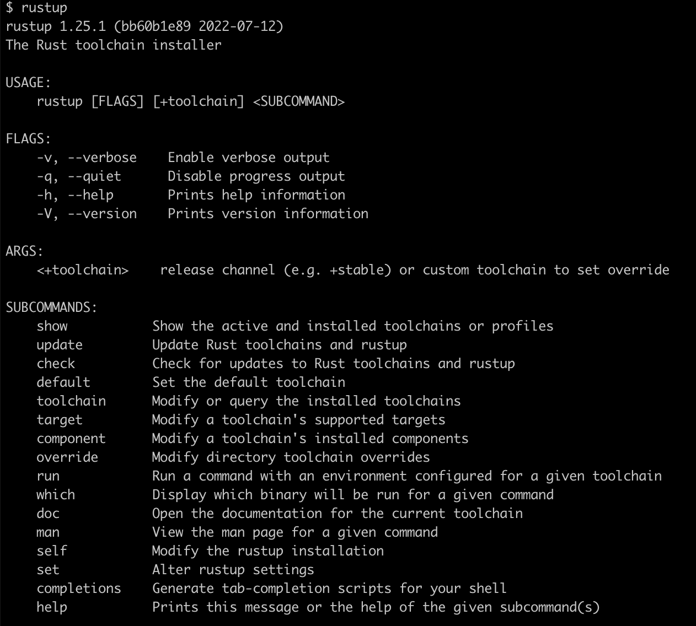
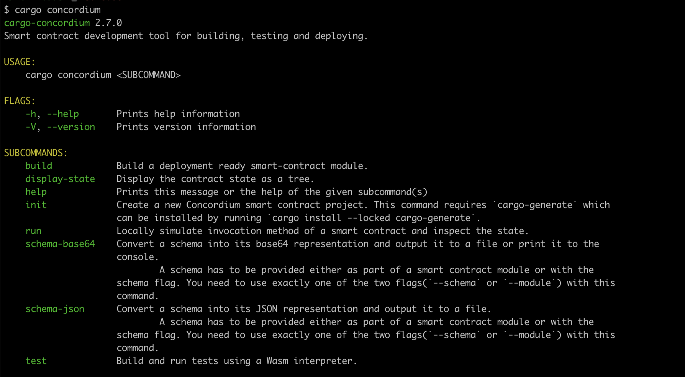
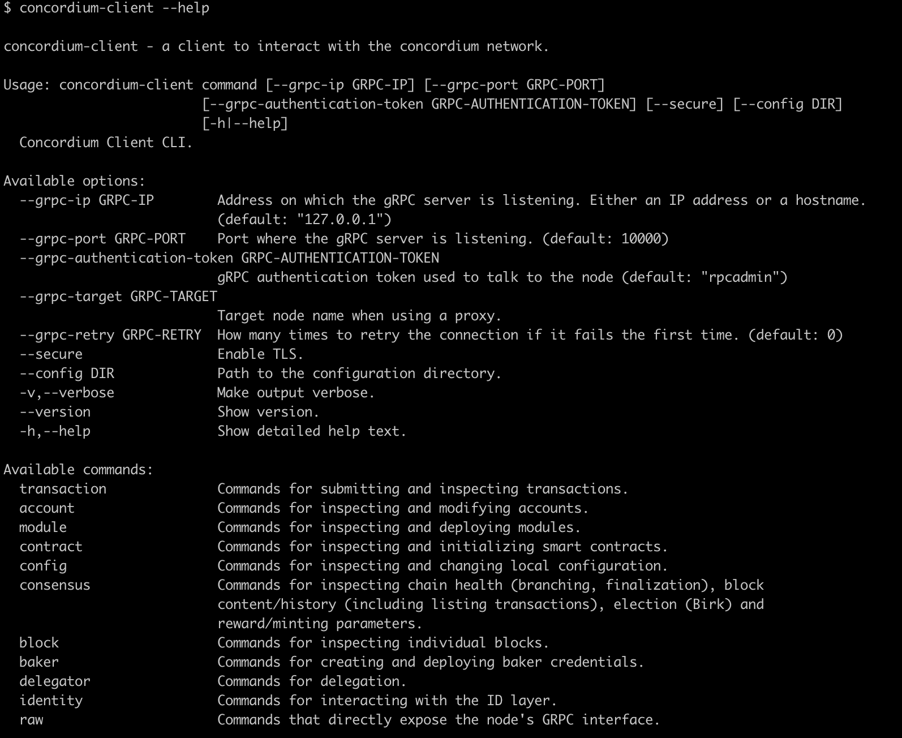
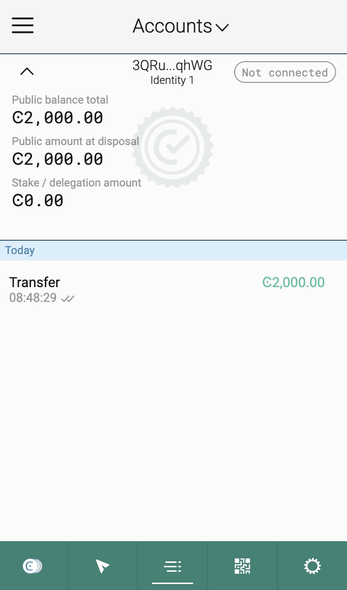
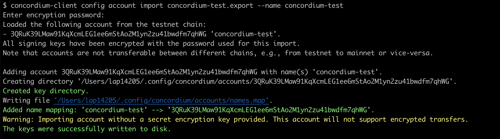

# Concordium Hackathon - TASK 1: Setup Development Environment

## My wallet address
- Concordium Address (mainnet): 45GytP6c3bF7CKM6twuEfSHxnYkG3GoLkrLNm72t6o9YHQEmMu 
- USDT Address (Metamask): 0x1557EE78Ab23F7264366a055eCAce48390b5B0C7 

## My process

### Finish Install rust


### Finish install cargo-concordium


### Finish install concordium-client


### Install wallet & create account
- I install wallet using brave browser
- Go to testnet by menu > Wallet setting > Network setting > Concordium testnet
- Create an identity
- Create an account (3QRuK39LMaw91KqXcmLEG1ee6mStAo2M1yn2zu41bwdfm7qhWG)
- Request 2000CCD tokens faucet



- Go to settings export private key

### Export account from web wallet and import to concordium-client
- Run command
```
concordium-client config account import <YOUR PUBLIC ADDRESS.export> --name <Your-Wallet-Name>
```




